<div align="center">

<!-- 🌌 DEEP SPACE HERO 🌌 -->


<br/>

<!-- TOP HEADER -->


<br/>

<!-- TERMINAL TYPING EFFECT -->
<p align="center">
  
</p>

<p align="center">
  <code>[ COORDS: 0.0.0.0 ]</code> • <code>[ OXYGEN: 100% ]</code> • <code>[ MISSION: EXPLORE ]</code>
</p>


<!-- SYSTEM DIAGNOSTICS SECTION -->
### 📟 SHIP_LOGS

<div align="left">

```bash
> whoami
Bitafarezi (Space Infiltrator)

> status --current
- Drifting through the codebase at light speed.
- Engineering robust systems in zero-gravity.
- Currently orbiting: [Web3, Cloud-Native, AI/ML]

> cat /proc/stellar_interests
- 3D Web Graphics (Three.js/WebGL)
- Cybersecurity & Encryption
- Low-level Systems Engineering
```

</div>


<!-- SKILLS GRID -->
### 🛠️ STELLAR_CAPABILITIES

<br/>

<div align="center">
  <a href="https://skillicons.dev">
    
  </a>
</div>

<br/>

<div align="center">
  
  
  
  
</div>


<!-- ANALYTICS SECTION -->
### 📊 COSMIC_ANALYTICS

<br/>

<div align="center">
  <table border="0">
    <tr>
      <td width="50%">
        
      </td>
      <td width="50%">
        
      </td>
    </tr>
  </table>
</div>

<div align="center">
  
</div>


<!-- 3D ARCHIVE SECTION -->
### 🧊 3D_STELLAR_ARCHIVE

<br/>

<div align="center">
  
</div>


<!-- SOCIAL CONNECT -->
### 📡 UPLINK_STATIONS

<br/>

<div align="center">
  <a href="https://linkedin.com/in/Bitafarezi" target="blank">
    
  </a>
  <a href="https://twitter.com/theebita" target="blank">
    
  </a>
  <a href="mailto:contact@bita.systems">
    
  </a>
</div>

<br/>

<div align="center">
  
</div>


<!-- FOOTER -->
<p align="center">
  <code>[DEEP_SPACE_MODE: ACTIVE]</code><br/>
  
</p>

</div>
