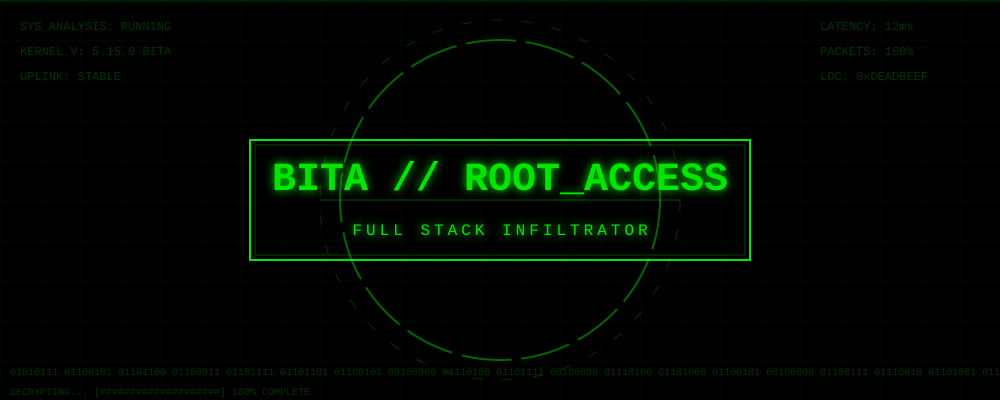

<!-- TOP SYSTEM BANNER -->

 

<!-- ADVANCED HUD OVERLAY -->

 

<!-- PRIMARY TERMINAL TYPING -->

  

  <code>[ CONNECTION_STATUS: SECURE ]</code> • <code>[ ENCRYPTION: AES-256 ]</code> • <code>[ UPTIME: 99.99% ]</code>

 

<!-- SECONDARY ACCESS STATUS -->

  

  <code>// ACCESSING DATABASE... SUCCESS.</code> 
  <code>// STATUS: TURNING_COFFEE_INTO_CODE.</code> 
  <code>// ROLE: FULL_STACK_INFILTRATOR.</code>

 

<!-- UPLINK NODES -->

  
  
  

<!-- SYSTEM CAPABILITIES -->
<h3 align="center" style="color: #00FF00; font-family: 'Courier New', monospace;">SYSTEM_CAPABILITIES 🛠️</h3>

  

 

  
  
  
  

<!-- NEURAL ANALYTICS DASHBOARD -->
<h3 align="center" style="color: #00FF00; font-family: 'Courier New', monospace;">NEURAL_ANALYTICS 📊</h3>

  <table border="0">
    <tr>
      <td width="50%" align="center">
        
      </td>
      <td width="50%" align="center">
        
      </td>
    </tr>
  </table>

 

  

<!-- SYSTEM SHUTDOWN -->

  

    <code>[ SYSTEM_SHUTDOWN_INITIATED ]</code> 
    
  

